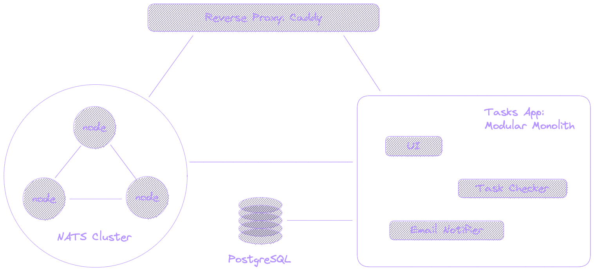

# Tasks App - Modular Monolith

A simple single binary task management app, built as a modular monolith. The app supports single-process and multi-process setups. In the multi-process setup, each instance is configured to run a subset of the modules.

## Tech Stack

| TECHNOLOGY                                 | DESCRIPTION                                   |
| ------------------------------------------ | --------------------------------------------- |
| [Caddy](https://caddyserver.com/)          | Reverse Proxy, Load Balancer                  |
| [NATS](https://nats.io/)                   | Messaging, WebSockets, KV Store, Object Store |
| [ZITADEL](https://zitadel.com/)            | Identity and Access Management (IAM)          |
| [PostgreSQL](https://www.postgresql.org/)  | Database                                      |
| [Terraform](https://www.terraform.io/)     | Infrastructure Automation                     |
| [Bash](https://www.gnu.org/software/bash/) | Scripting                                     |
| [Go](https://go.dev/)                      | Programming Language                          |
| [htmx](https://htmx.org/)                  | Web Technology                                |
| [Hyperscript](https://hyperscript.org/)    | Frontend Scripting Language                   |
| [C4 model](https://c4model.com/)           | Software Architecture Visualization           |

## Examples

See the `/deploy/dev` directory for some example setups.
